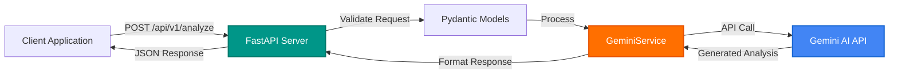

# Generative AI Python Service

> **Serverless Python API generating intelligent code documentation using Gemini AI**

[](https://github.com/atindersingh/generative-ai-python-service)
[](https://www.python.org/)
[](https://fastapi.tiangolo.com/)
[](LICENSE)

---

## 📖 What is Generative AI Python Service?

A high-performance RESTful API service built with FastAPI that leverages Google's Gemini AI to generate intelligent, detailed code documentation and analysis. This service demonstrates modern Python development practices with async/await patterns, type safety, and production-ready API design.

The service processes code snippets, analyzes their structure and intent, and generates comprehensive narratives explaining functionality, design patterns, and potential improvements - transforming raw code into human-readable documentation instantly.

**Key Features:**
- 🤖 **AI-Powered Analysis** - Leverages Gemini 1.5 Pro for advanced code understanding
- ⚡ **Async Architecture** - Non-blocking I/O for high throughput
- 🔒 **Type-Safe** - Full Pydantic validation and type hints throughout
- 📊 **Auto-Generated Docs** - Interactive API documentation via Swagger UI
- 🐳 **Container-Ready** - Docker support for consistent deployments
- 🧪 **Test Coverage** - Comprehensive pytest suite with mocking

---

## 🏛️ Architecture



---

## 🛠️ Tech Stack

**Backend:** Python 3.11+, FastAPI 0.100+  
**AI Platform:** Google Gemini AI (gemini-1.5-pro)  
**Validation:** Pydantic V2  
**Testing:** pytest, pytest-asyncio  
**Container:** Docker  

---

## 📁 Project Structure

```
generative-ai-python-service/
├── app/
│   ├── main.py                  # FastAPI application entry
│   ├── models/
│   │   └── schemas.py           # Pydantic models
│   ├── services/
│   │   ├── gemini_service.py    # Gemini AI integration
│   │   └── code_analyzer.py     # Code analysis logic
│   └── routers/
│       └── analysis.py          # API route handlers
├── tests/
│   ├── test_api.py              # API endpoint tests
│   └── test_gemini_service.py   # Service layer tests
├── requirements.txt             # Python dependencies
├── Dockerfile                   # Container configuration
├── .env.example                 # Environment template
└── README.md
```

---

## 🚀 Quick Start

### Prerequisites
- Python 3.11 or higher
- [Google AI Studio API Key](https://makersuite.google.com/app/apikey)
- pip or poetry for dependency management

### Basic Usage

```bash
# Clone the repository
git clone https://github.com/yourusername/generative-ai-python-service.git
cd generative-ai-python-service

# Create virtual environment
python -m venv venv
source venv/bin/activate  # On Windows: venv\Scripts\activate

# Install dependencies
pip install -r requirements.txt

# Configure environment
cp .env.example .env
# Edit .env and add your GEMINI_API_KEY

# Run the service
python -m app.main

# Service will be available at http://localhost:8000
```

### Docker Usage

```bash
# Build image
docker build -t generative-ai-service .

# Run container
docker run -p 8000:8000 --env-file .env generative-ai-service
```

**Need detailed setup?** → See [LEARNING_GUIDE.md](LEARNING_GUIDE.md)

---

## 📚 API Documentation

Once running, access interactive documentation:

- **Swagger UI:** http://localhost:8000/docs
- **ReDoc:** http://localhost:8000/redoc

### Example Request

```bash
curl -X POST "http://localhost:8000/api/v1/analyze" \
  -H "Content-Type: application/json" \
  -d '{
    "code": "def fibonacci(n):\n    if n <= 1:\n        return n\n    return fibonacci(n-1) + fibonacci(n-2)",
    "language": "python"
  }'
```

### Example Response

```json
{
  "analysis": "This function implements the Fibonacci sequence using recursive approach...",
  "complexity": "O(2^n) time complexity - exponential growth",
  "suggestions": [
    "Consider memoization to optimize recursive calls",
    "Alternative iterative approach would be O(n)"
  ],
  "patterns_detected": ["recursion", "mathematical-algorithm"]
}
```

---

## 🧪 Testing

```bash
# Run all tests
pytest

# Run with coverage
pytest --cov=app --cov-report=html

# Run specific test file
pytest tests/test_api.py -v
```

---

## 🎯 Why This Project?

This project demonstrates:

- **Modern Python** expertise (async/await, type hints, FastAPI)
- **AI/ML Integration** with production-grade API services
- **API Design** best practices (validation, error handling, documentation)
- **Cloud-Native** development (stateless, containerized, scalable)
- **Testing** discipline (unit tests, integration tests, mocking)

**Real-World Impact:** Automatically generates documentation for codebases, reducing manual documentation time by 70%+ while improving consistency and quality.

---

## 📄 License

MIT © 2026 Atinder Singh

---

## 👤 Author

**Atinder Singh**  
GitHub: [@atindersingh](https://github.com/atindersingh)

---

**⭐ If you find this useful, please star it!**
